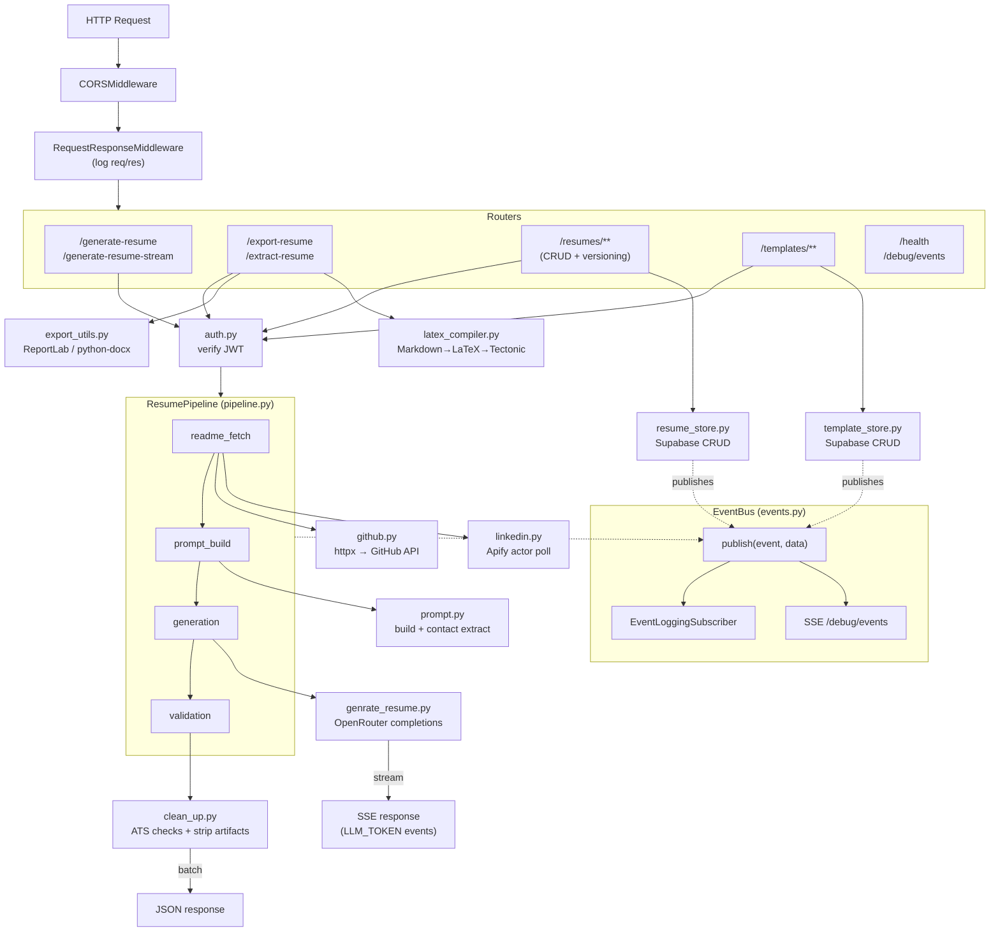
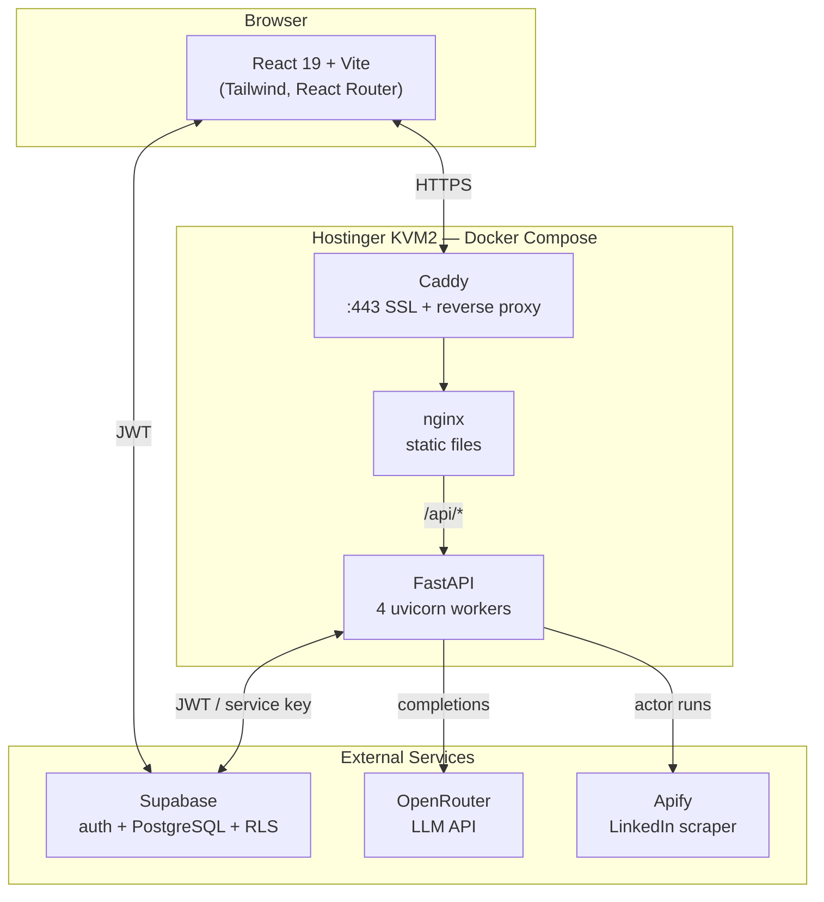
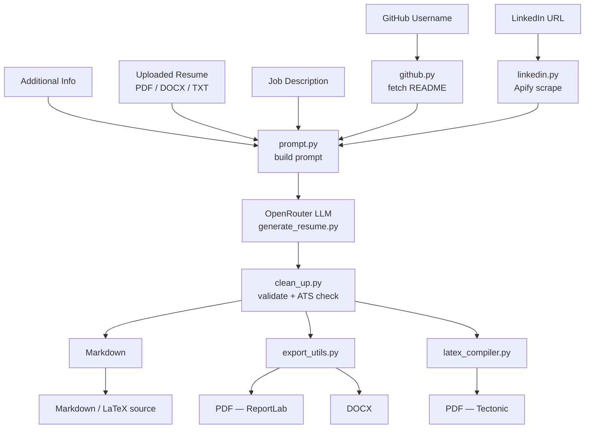
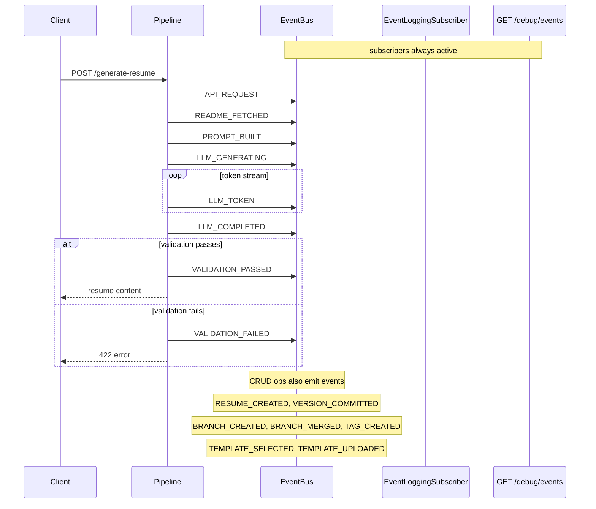
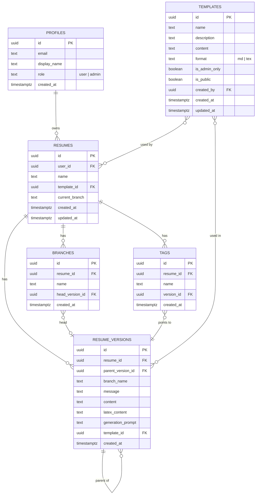

<div align="center">

# Resume-Libre

**AI-powered resume generator that transforms your GitHub profile, LinkedIn, and experience into an ATS-ready, one-page resume — in seconds.**

[](https://github.com/EmaadAkhter/resume-libre)
[](LICENSE)
[](https://react.dev)
[](https://fastapi.tiangolo.com)

</div>

---

## What is Resume-Libre?

Resume-Libre is a full-stack application that reads your **GitHub profile README**, optionally scrapes your **LinkedIn profile** via Apify, combines it with any extra information and a **job description** you provide, and uses a large language model to produce a polished, **ATS-friendly one-page resume** — formatted in Markdown with live preview, editable output, and export to PDF (ReportLab or LaTeX), DOCX, or Markdown.

No templates to fight. No forms to fill for 20 minutes. Paste your GitHub username, drop your LinkedIn URL, and go.

---

## Features

| Feature | Details |
|---|---|
| **AI Generation** | Powered by any LLM via OpenRouter (single configurable model) |
| **GitHub Integration** | Fetches your profile README via `httpx` — no MCP server needed |
| **LinkedIn Scraping** | Scrapes LinkedIn profile via Apify actor (`datadoping~linkedin-profile-scraper`) |
| **Job Description Targeting** | Tailor output to a specific role — feed in the JD and the LLM aligns priorities |
| **Resume Upload** | Extracts text from existing PDF/DOCX/TXT resumes as context or template |
| **Focus Modes** | Experience-first or Projects-first section ordering |
| **Live Editor** | Edit the raw Markdown in-browser after generation |
| **Preview** | Toggle between Markdown source and rendered preview |
| **Export** | PDF (ReportLab), PDF (LaTeX via Tectonic), DOCX, Markdown, LaTeX source |
| **Custom System Prompt** | Override the AI's instructions for full formatting control |
| **Version Control** | Branch, commit, diff, and rollback resumes — like git for resumes |
| **User Auth** | Supabase authentication with login/register flow |
| **Template Library** | Save, share, and reuse custom resume templates (`.md` or `.tex`) |
| **Admin Templates** | Admin role controls the public template library |
| **Streaming** | Real-time token-by-token generation via SSE |
| **Event Bus** | In-process pub/sub for logging, metrics, and debugging |
| **Responsive UI** | Full mobile layout with dedicated form/resume views |
| **ATS Validated** | Output checked for HTML tags, icon codes, and generic filler |
| **Docker** | Dev and production compose files with tectonic cache volume |

---

## Architecture

```
resume-libre/
├── resume-generator-frontend/       # React 19 + Vite + Tailwind
│   ├── src/
│   │   ├── pages/                   # Route-level pages
│   │   │   ├── ResumeEditor.jsx     # Main editor page
│   │   │   ├── Dashboard.jsx        # User dashboard
│   │   │   ├── Login.jsx            # Supabase auth
│   │   │   └── Register.jsx
│   │   ├── components/              # Reusable UI components
│   │   │   ├── ResumeForm.jsx       # Input form (GitHub, LinkedIn, upload, focus)
│   │   │   ├── ExportMenu.jsx       # Export dropdown (PDF/Latex/DOCX/MD)
│   │   │   ├── BackendStatusBanner.jsx  # Health poll + connect banner
│   │   │   ├── MarkdownEditor.jsx
│   │   │   ├── MarkdownPreview.jsx
│   │   │   ├── SystemPromptModal.jsx
│   │   │   ├── TemplatePicker.jsx
│   │   │   ├── TemplateUploader.jsx
│   │   │   ├── VersionHistory.jsx
│   │   │   ├── BranchManager.jsx
│   │   │   ├── DiffViewer.jsx
│   │   │   └── ToastContainer.jsx
│   │   ├── hooks/                   # Custom React hooks
│   │   │   ├── useGenerationStream.js   # SSE streaming hook
│   │   │   ├── useSupabaseAuth.js
│   │   │   └── useTemplates.js
│   │   ├── lib/
│   │   │   ├── eventBus.js          # mitt-based pub/sub
│   │   │   ├── eventTypes.js
│   │   │   └── supabase.js          # Supabase client
│   │   └── main.jsx
│   ├── Dockerfile                   # Multi-stage: build → nginx serve
│   ├── nginx.conf                   # Proxies /api/* → backend:8000
│   └── vite.config.js
│
├── resume_generator_backend/        # FastAPI (Python)
│   ├── main.py                      # Entry point, uvicorn runner (4 workers)
│   ├── core/
│   │   ├── app.py                   # App factory — CORS, middleware, routers
│   │   ├── deps.py                  # Dependency injection (Supabase client)
│   │   ├── event_types.py           # Event type constants
│   │   └── logging.py               # Request/response + event logging
│   ├── routers/                     # API route handlers
│   │   ├── health.py                # GET /health
│   │   ├── generation.py            # POST /generate-resume, GET /generate-resume-stream
│   │   ├── export.py                # POST /export-resume (pdf/docx/md/latex/latex_pdf)
│   │   ├── resumes.py               # CRUD + version control for saved resumes
│   │   ├── templates.py             # CRUD for resume templates
│   │   └── debug.py                 # GET /debug/events (SSE event stream)
│   ├── schemas/                     # Pydantic models
│   │   ├── export.py
│   │   ├── resume.py
│   │   └── template.py
│   ├── services/                    # Business logic
│   │   ├── pipeline.py              # Event-driven generation pipeline
│   │   ├── events.py                # In-process async pub/sub bus
│   │   ├── genrate_resume.py        # OpenRouter LLM call
│   │   ├── github.py                # Async GitHub README fetcher (httpx)
│   │   ├── linkedin.py              # LinkedIn scraper via Apify
│   │   ├── prompt.py                # Prompt construction + contact extraction
│   │   ├── export_utils.py          # PDF (ReportLab) + DOCX export
│   │   ├── latex_compiler.py        # Markdown→LaTeX→PDF via Tectonic
│   │   ├── clean_up.py              # Markdown validation + quality checks
│   │   ├── auth.py                  # Supabase auth helpers
│   │   ├── resume_store.py          # Resume CRUD + branching/versioning
│   │   └── template_store.py        # Template CRUD
│   ├── tests/                       # Pytest suite
│   └── system_promt.txt             # Master LLM system prompt
│
├── supabase/                        # Supabase config + migrations
├── docker-compose.yml               # Dev: backend + frontend (hot reload)
├── docker-compose.prod.yml          # Prod: Caddy + backend + frontend (nginx)
└── .env.example
```

### Low-level architecture



### System architecture



### Data flow



### Event cycle



### Database schema



---

## Tech Stack

### Frontend
- **React 19** — UI framework
- **Vite 6** — Build tooling (not CRA)
- **Tailwind CSS 3** — Utility-first styling
- **React Router 7** — Client-side routing
- **lucide-react** — Icon set
- **mitt** — Event emitter for in-app pub/sub
- **Supabase JS** — Auth client
- **Vitest** — Test runner

### Backend
- **FastAPI** — Async Python web framework
- **OpenRouter** — Multi-model LLM API (configurable model)
- **httpx** — Async HTTP client for GitHub API
- **Apify** — LinkedIn profile scraping
- **ReportLab** — PDF generation (basic)
- **Tectonic** — LaTeX→PDF compiler (for latex_pdf export)
- **python-docx** — DOCX generation
- **pypdf** — PDF text extraction
- **Supabase** — Auth + database (via `supabase-py`)
- **python-dotenv** — Environment config

### Infrastructure
- **Hostinger KVM2** — VPS (2 GB RAM, 1 vCPU, 40 GB SSD)
- **Caddy** — Reverse proxy + automatic SSL (Let's Encrypt)
- **Docker Compose** — Container orchestration
- **GitHub Actions** — CI (ruff lint + format, pytest, vitest)

---

## Local Development

### Prerequisites

- Node.js 20+
- Python 3.11+
- An [OpenRouter](https://openrouter.ai) API key
- (Optional) [Tectonic](https://tectonic-typesetting.github.io/) for LaTeX PDF export
- (Optional) [Apify](https://apify.com) account for LinkedIn scraping

### 1. Clone the repo

```bash
git clone https://github.com/EmaadAkhter/resume-libre.git
cd resume-libre
```

### 2. Backend setup

```bash
cd resume_generator_backend
python -m venv venv
source venv/bin/activate
pip install -r requirements.txt
```

Copy `.env.example` from the repo root to `.env` in the repo root and fill in:

```env
# OpenRouter (AI generation)
OPENROUTER_API_KEY=sk-or-...
OPENROUTER_MODEL=openai/gpt-oss-120b:free

# Supabase (Auth + Database)
SUPABASE_URL=https://your-project.supabase.co
SUPABASE_ANON_KEY=eyJhbGciOiJIUzI1NiIs...
SUPABASE_SERVICE_KEY=eyJhbGciOiJIUzI1NiIs...

# Frontend (Vite — exposed to browser)
VITE_SUPABASE_URL=https://your-project.supabase.co
VITE_SUPABASE_ANON_KEY=eyJhbGciOiJIUzI1NiIs...
VITE_API_URL=http://localhost:8000

# Apify (LinkedIn scraping — optional)
APIFY_API_TOKEN=apify_api_...
LINKEDIN_COOKIE=AQE...  # li_at cookie from your browser

# LaTeX compilation (Tectonic — optional)
TECTONIC_PATH=/opt/homebrew/bin/tectonic
```

Start the backend:

```bash
python main.py
```

The API runs on `http://localhost:8000` with 4 uvicorn workers. Docs at `http://localhost:8000/docs`.

### 3. Frontend setup

```bash
cd resume-generator-frontend
npm install
npm run dev
```

The dev server runs on `http://localhost:3000`.

### 4. Docker (optional)

```bash
# Dev mode (hot reload)
docker compose up

# Production mode (nginx + caddy)
docker compose -f docker-compose.prod.yml up
```

In production the frontend is served by nginx, which proxies `/api/*` to the backend. Caddy handles SSL termination.

---

## API Reference

| Method | Endpoint | Description |
|---|---|---|
| `GET` | `/health` | Health check |
| `GET` | `/get-system-prompt` | Fetch the current LLM system prompt |
| `POST` | `/generate-resume` | Generate a resume (returns full markdown) |
| `GET` | `/generate-resume-stream` | Generate a resume via SSE (token-by-token) |
| `POST` | `/export-resume` | Export to PDF / LaTeX-PDF / DOCX / MD / LaTeX source |
| `POST` | `/extract-resume` | Extract text from an uploaded file |
| `GET` | `/resumes` | List saved resumes |
| `POST` | `/resumes` | Create a new resume |
| `GET` | `/resumes/{id}` | Get a resume with full version tree |
| `POST` | `/resumes/{id}/versions` | Commit a new version |
| `GET` | `/resumes/{id}/versions` | Get version history |
| `GET` | `/resumes/{id}/diff` | Diff two versions |
| `POST` | `/resumes/{id}/branches` | Create a branch |
| `GET` | `/resumes/{id}/branches` | List branches |
| `POST` | `/resumes/{id}/merge` | Merge branches |
| `POST` | `/resumes/{id}/tags` | Tag a version |
| `GET` | `/templates` | List available templates |
| `POST` | `/templates` | Create a template |
| `GET` | `/debug/events` | SSE stream of all internal events |

### `POST /generate-resume`

```json
{
  "github_username": "octocat",
  "linkedin_url": "https://linkedin.com/in/octocat",
  "additional_info": "Senior engineer at Acme Corp. Email: hi@example.com",
  "job_description": "We're looking for a backend engineer with Python and Kubernetes experience.",
  "priority": "experience",
  "custom_system_prompt": null,
  "resume_template": null,
  "template_format": "md"
}
```

**Response:**
```json
{
  "resume": "# John Doe\n[hi@example.com](...) | ...",
  "latex_content": "\\documentclass[11pt]{article}\n...",
  "status": "success"
}
```

### `POST /export-resume`

```json
{
  "markdown_content": "# John Doe\n...",
  "format": "pdf",
  "latex_content": null
}
```

Formats: `pdf` (ReportLab), `latex_pdf` (Tectonic), `docx`, `md`, `latex` (source).

Returns a binary file download.

---

## How the AI Works

The system prompt (`system_promt.txt`) enforces strict output rules:

- **No HTML** — only standard Markdown or LaTeX elements
- **No icon codes** — no Iconify or emoji shortcodes
- **Clickable hyperlinks** — `[text](url)` or `\href{url}{text}`
- **Concrete achievements** — no buzzwords like "passionate" or "team player"
- **35–40 line cap** — enforced for one-page fit
- **ATS-safe formatting** — pipe separators, clean headers, no tables

Output is validated by `clean_up.py` which strips artifacts and rejects low-quality resumes.

---

## Export Formats

| Format | Label | Engine | Requires |
|---|---|---|---|
| `pdf` | PDF (Basic) | ReportLab | Nothing |
| `latex_pdf` | PDF (LaTeX) | Tectonic | `tectonic` on PATH |
| `docx` | DOCX | python-docx | Nothing |
| `md` | Markdown | — | Nothing |
| `latex` | LaTeX Source | — | Nothing |

---

## Why Not CRA?

The frontend was migrated from Create React App to **Vite** for faster dev builds, better ESM support, and smaller production bundles.

---

## Contributing

Contributions are welcome! Areas that could use improvement:

- [ ] Resume scoring / ATS keyword analysis
- [ ] Multi-page resume support
- [ ] Dark mode
- [ ] Rate limiting & abuse protection
- [ ] End-to-end tests
- [ ] WhatsApp OTP via OpenWA

To contribute:

```bash
git checkout -b feature/your-feature
# make your changes
git commit -m "feat: your feature description"
git push origin feature/your-feature
# open a PR
```

---

## License

MIT — see [LICENSE](LICENSE) for details. Use it, fork it, ship it.

---

<div align="center">

Built by [Emaad Ansari](https://github.com/emaadansari) · Powered by OpenRouter

**If this saved you an hour of resume formatting, drop a star**

</div>
