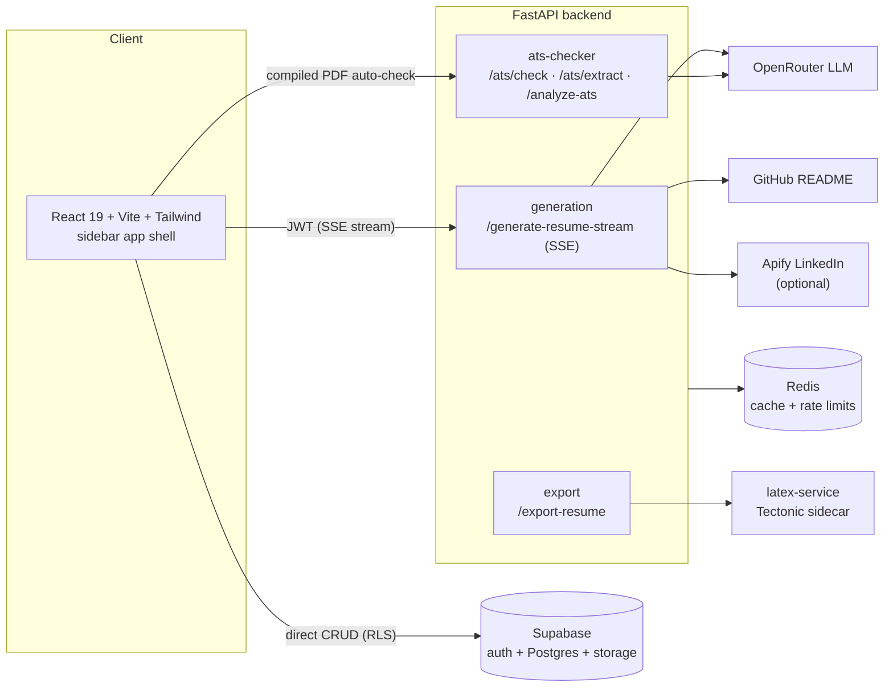
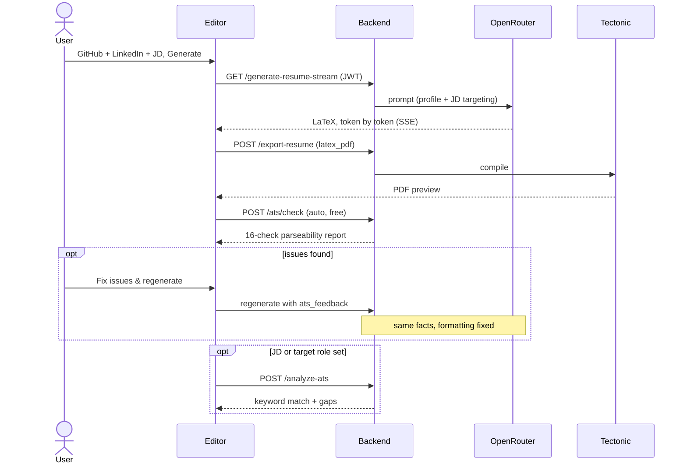
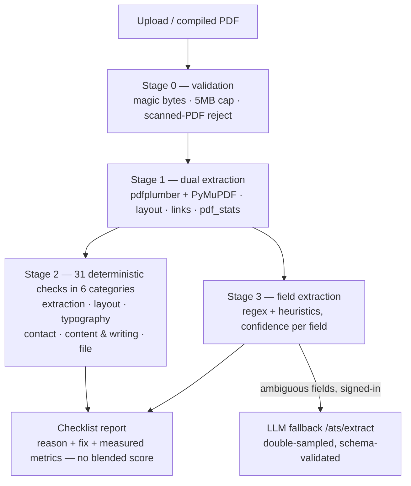

<div align="center">


**Open-source AI resume generator: your GitHub profile, LinkedIn, and a job description in — a polished, one-page LaTeX PDF out.**

[](LICENSE)
[](https://fastapi.tiangolo.com)
[](https://react.dev)

</div>

---

## What is Resume-Libre?

Resume-Libre reads your **GitHub profile README**, takes your **LinkedIn profile** (paste the text, or let the server scrape it), combines that with any extra information and a **job description** you provide, and uses an LLM (via OpenRouter) to write a complete **LaTeX document** — compiled to a real PDF by [Tectonic](https://tectonic-typesetting.github.io/) and streamed into the editor token by token.

Every compiled PDF is automatically run through the built-in **ATS parseability checker** — 31 deterministic checks across six categories, with measured values and concrete fixes, and a one-click **"Fix issues & regenerate"** loop that feeds the findings back into the LLM. No fake "ATS score". No web-page-pretending-to-be-a-PDF. Real typesetting, tailored to the role, verified parseable.

## Features

| Feature | Details |
| --- | --- |
| **AI generation** | Any LLM via OpenRouter (configurable model), streamed via SSE |
| **ATS parseability checker** | 31 deterministic checks in six categories (extraction, layout, typography, contact, content, file) — grouped checklist with reasons, fixes, and threshold meters, never a fake score. Free at `/ats-check`, no account |
| **Fix & regenerate loop** | Checker findings are injected into the prompt and the resume regenerates with formatting fixed, facts untouched |
| **ATS keyword match** | Post-generation gap analysis against a pasted job description or one of 10 role presets — match %, matched/missing keywords, suggestions |
| **Guided intake wizard** | No GitHub? 7-profession step-by-step wizard (software, finance, medical, legal, design, MBA, general) |
| **GitHub integration** | Fetches your profile README as raw material |
| **LinkedIn input** | Paste your profile text (default, no scraping), or configure Apify scraping |
| **Job targeting** | Feed in a job description — the LLM aligns your experience to it |
| **Resume upload** | Extracts text from existing PDF/DOCX/TXT resumes, in memory only |
| **LaTeX pipeline** | LLM emits a complete LaTeX document; Tectonic compiles the PDF |
| **Templates** | 5 built-in LaTeX styles (Awesome, ModernCV, AltaCV, Deedy, Friggeri lookalikes) + your own `.tex` uploads |
| **Version control** | Branch, commit, and roll back resumes — like git for resumes |
| **Public hosting** | One-click publish to a shareable page at `/r/<user_id>` — unpublish any time |
| **Auth & privacy** | Supabase auth, row-level security, uploads processed in memory and never written to disk |
| **Demo mode** | `DEMO_MODE=true` runs the whole stack with zero API keys — canned LLM output, real PDF compile |
| **Self-hostable** | Docker Compose for dev and production (Caddy + auto-TLS), AGPL-3.0 |

## Quickstart (self-host)

```bash
git clone https://github.com/EmaadAkhter/Resume-Libre.git
cd Resume-Libre
cp .env.example .env   # fill in OpenRouter + Supabase keys
docker compose up
```

No keys at hand? **Demo mode** boots the full stack with zero configuration (canned LLM output, real PDF compile):

```bash
echo "DEMO_MODE=true" > .env && docker compose up   # then open /demo
```

Frontend at http://localhost:3000, API at http://localhost:8000.

You need:
- A free [OpenRouter](https://openrouter.ai/keys) API key (free models work — default is `openai/gpt-oss-120b:free`)
- A free [Supabase](https://supabase.com) project (run the SQL in `supabase/migrations/` in order)
- Optionally an [Apify](https://apify.com) token for LinkedIn URL scraping — skip it and use paste-text input

## Architecture


```mermaid
flowchart LR
    subgraph Client
        FE["React 19 + Vite + Tailwind<br/>sidebar app shell"]
    end

    subgraph Backend["FastAPI backend"]
        GEN["generation<br/>/generate-resume-stream (SSE)"]
        EXP["export<br/>/export-resume"]
        ATS["ats-checker<br/>/ats/check · /ats/extract · /analyze-ats"]
    end

    FE -- "JWT (SSE stream)" --> GEN
    FE -- "compiled PDF auto-check" --> ATS
    FE -- "direct CRUD (RLS)" --> SB[("Supabase<br/>auth + Postgres + storage")]

    GEN --> OR["OpenRouter LLM"]
    GEN --> GH["GitHub README"]
    GEN --> LI["Apify LinkedIn<br/>(optional)"]
    EXP --> TEC["latex-service<br/>Tectonic sidecar"]
    ATS --> OR
    Backend --> RD[("Redis<br/>cache + rate limits")]
```

### Generation → check → fix loop


```mermaid
sequenceDiagram
    actor U as User
    participant FE as Editor
    participant BE as Backend
    participant LLM as OpenRouter
    participant TEC as Tectonic

    U->>FE: GitHub + LinkedIn + JD, Generate
    FE->>BE: GET /generate-resume-stream (JWT)
    BE->>LLM: prompt (profile + JD targeting)
    LLM-->>FE: LaTeX, token by token (SSE)
    FE->>BE: POST /export-resume (latex_pdf)
    BE->>TEC: compile
    TEC-->>FE: PDF preview
    FE->>BE: POST /ats/check (auto, free)
    BE-->>FE: 16-check parseability report
    opt issues found
        U->>FE: Fix issues & regenerate
        FE->>BE: regenerate with ats_feedback
        Note over BE,LLM: same facts, formatting fixed
    end
    opt JD or target role set
        FE->>BE: POST /analyze-ats
        BE-->>FE: keyword match + gaps
    end
```

### ATS checker pipeline (no LLM on the free path)


```mermaid
flowchart TD
    UP["Upload / compiled PDF"] --> S0["Stage 0 — validation<br/>magic bytes · 5MB cap · scanned-PDF reject"]
    S0 --> S1["Stage 1 — dual extraction<br/>pdfplumber + PyMuPDF · layout · links · pdf_stats"]
    S1 --> S2["Stage 2 — 31 deterministic checks in 6 categories<br/>extraction · layout · typography<br/>contact · content & writing · file"]
    S1 --> S3["Stage 3 — field extraction<br/>regex + heuristics, confidence per field"]
    S3 -->|ambiguous fields, signed-in| LLMF["LLM fallback /ats/extract<br/>double-sampled, schema-validated"]
    S2 --> REP["Checklist report<br/>reason + fix + measured metrics — no blended score"]
    S3 --> REP
```

- **Frontend** (`resume-generator-frontend/`): React 19, Vite, Tailwind. Talks to Supabase directly for resume/version CRUD, and to the backend for generation/export/checking.
- **Backend** (`resume_generator_backend/`): FastAPI. Fetches GitHub/LinkedIn data, builds the prompt, streams LLM output, compiles LaTeX via the sidecar, runs the ATS checker. JWT-protected, Redis-backed rate limits.
- **LaTeX sidecar** (`latex-service/`): tiny FastAPI service wrapping the Tectonic binary — keeps the heavyweight LaTeX toolchain out of the main API image.
- **Supabase** (`supabase/migrations/`): auth, Postgres with row-level security, storage buckets.

More detail in [ARCHITECTURE.md](ARCHITECTURE.md).

## Environment variables

See [.env.example](.env.example) for the full annotated list. The essentials:

| Variable | Purpose |
| --- | --- |
| `OPENROUTER_API_KEY` | LLM access (required) |
| `OPENROUTER_MODEL` | Model id, default `openai/gpt-oss-120b:free` |
| `SUPABASE_URL` / `SUPABASE_ANON_KEY` / `SUPABASE_SERVICE_KEY` | Auth + database |
| `VITE_SUPABASE_URL` / `VITE_SUPABASE_ANON_KEY` / `VITE_API_URL` | Frontend build |
| `APIFY_API_TOKEN` | Optional — LinkedIn URL scraping |
| `REDIS_URL` | Cache + rate-limit counters (set automatically in compose) |
| `ALLOWED_ORIGINS` | Comma-separated CORS origins for production |

## Development

```bash
# Backend
cd resume_generator_backend
python -m venv venv && source venv/bin/activate
pip install -r requirements.txt
pytest                       # run tests
uvicorn main:app --reload

# Frontend
cd resume-generator-frontend
npm install
npm run dev                  # Vite dev server
npx vitest run               # tests
```

CI runs ruff, pytest, eslint, vitest, and a production build on every push. Pre-commit hooks (`pre-commit install`) mirror the same checks.

## Privacy

Uploaded files are processed **in memory and never written to disk**. Resume content is never used for anything beyond your own request. Full policy: [PRIVACY.md](PRIVACY.md) · [TERMS.md](TERMS.md)

## Contributing

Contributions welcome — see [CONTRIBUTING.md](CONTRIBUTING.md). Good first issues: LaTeX resume templates ([#12](https://github.com/EmaadAkhter/Resume-Libre/issues/12)–[#14](https://github.com/EmaadAkhter/Resume-Libre/issues/14)), and the wired-but-unrouted Fresher Wizard ([#3](https://github.com/EmaadAkhter/Resume-Libre/issues/3)).

## Funding

Resume-Libre is free and always will be. If it saved you time, [sponsor the project](https://github.com/sponsors/EmaadAkhter) — funding goes to hosting the free public instance and to calibrating the parseability checker against real resume data. Machine-readable details: [funding.json](funding.json).

## License

AGPL-3.0 — see [LICENSE](LICENSE).

Why AGPL? Resume-Libre is and will stay open source. AGPL keeps it that way: use it, fork it, self-host it freely — but if you run a modified version as a service, share your changes back. Code published before the license change (through commit `dee7144`) remains available under MIT.

---

<div align="center">

Built by [Emaad Ansari](https://github.com/EmaadAkhter) · Powered by OpenRouter

**If this saved you an hour of resume formatting, drop a star**

</div>
